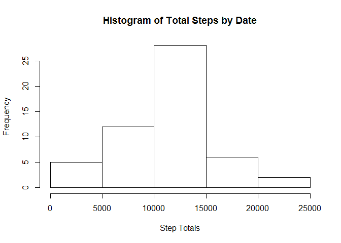

# PA1_template
Gage Fisher  
Sunday, January 18, 2015  

This R Markdown document will examine the activity.csv file provided for Peer Assessment 1 in Reproducible Research.

First make sure that the ggplot2 package is installed.Then we will read in the activity file.


```r
install.packages("ggplot2", repos='http://cran.us.r-project.org')
```

```
## Installing package into 'C:/Users/The Fishers/Documents/R/win-library/3.1'
## (as 'lib' is unspecified)
```

```
## package 'ggplot2' successfully unpacked and MD5 sums checked
## 
## The downloaded binary packages are in
## 	C:\Users\The Fishers\AppData\Local\Temp\RtmpcTprfx\downloaded_packages
```

```r
table.data <- read.csv("activity.csv", header = TRUE)
library(ggplot2)
```

```
## Warning: package 'ggplot2' was built under R version 3.1.2
```

```r
library(httpuv)
```

```
## Warning: package 'httpuv' was built under R version 3.1.1
```

```r
library(knitr)
```

```
## Warning: package 'knitr' was built under R version 3.1.1
```

```r
library(rmarkdown)
```

Then we can begin addressing question 1. First we will delete all rows with NA values in the 'steps' column.


```r
table.new <- na.omit(table.data)
```


Subset data by date for our histogram


```r
table.agg <- aggregate(.~date, data = table.new, FUN = sum)
```


Then we will subset only the columns that we need.


```r
table.hist <- c("date", "steps")
table.hist.set <- subset(table.agg[table.hist],)
```

Calculate the mean and median of the steps


```r
table.mean <- mean(as.numeric(table.hist.set$steps))
table.mean
```

```
## [1] 10766
```

```r
table.median <- median(as.numeric(table.hist.set$steps))
table.median
```

```
## [1] 10765
```


Print a histogram of the total steps by date


```r
hist(table.hist.set$steps, main = "Histogram of Total Steps by Date", xlab = "Step Totals")
```

 


Question 2

Returning to our original table, we subset the columns that we need.


```r
table.steps <- c("interval", "steps")
table.steps.set <- subset(table.new[table.steps],)
```


Calculate the mean of total


```r
steps.mean <- aggregate(steps ~ interval, table.steps.set, mean)
```


Print a line chart showing the average steps per interval across dates


```r
steps.plot <- ggplot(steps.mean, aes(x = interval, y = steps))
steps.plot <- steps.plot + geom_line()
plot(steps.plot)
```

 


Question 3

Returning to our original values, we count the number of NA values


```r
count.na <- sum(is.na(table.data$steps))
count.na
```

```
## [1] 2304
```


Replace NA with the total mean from question 1


```r
table.data[is.na(table.data)] <- 10766
```


Subset data by date for histogram


```r
data.agg <- aggregate(.~date, data = table.data, FUN = sum)
```


Subset the columns you need


```r
data.hist <- c("date", "steps")
data.hist.set <- subset(data.agg[data.hist],)
```


Calculate the mean and median of the total


```r
data.mean <- mean(as.numeric(data.hist.set$steps))
data.mean
```

```
## [1] 415991
```

```r
data.median <- median(as.numeric(data.hist.set$steps))
data.median
```

```
## [1] 11458
```


Print histogram


```r
hist(data.hist.set$steps, main = "Histogram of Total Steps by Date", xlab = "Step Totals")
```

 


Question 4

Add a column for day of the week and calculate its value based on date


```r
table.data$day <- weekdays(as.Date(table.data$date))
table.weekday <- table.data[with(table.data, day == "Monday" | day == "Tuesday" | day == "Wednesday" | day == "Thursday" | day == "Friday"),]
```


Calculate mean of total


```r
weekday.mean <- mean(as.numeric(table.weekday$steps))
```


Subset the columns you need


```r
weekday.steps <- c("interval", "steps")
weekday.steps.set <- subset(table.weekday[weekday.steps],)
```


Print line chart


```r
weekday.steps.mean <- aggregate(steps ~ interval, weekday.steps.set, mean)
weekday.plot <- ggplot(weekday.steps.mean, aes(x = interval, y = steps))
weekday.plot <- weekday.plot + geom_line()
plot(weekday.plot)
```

 

